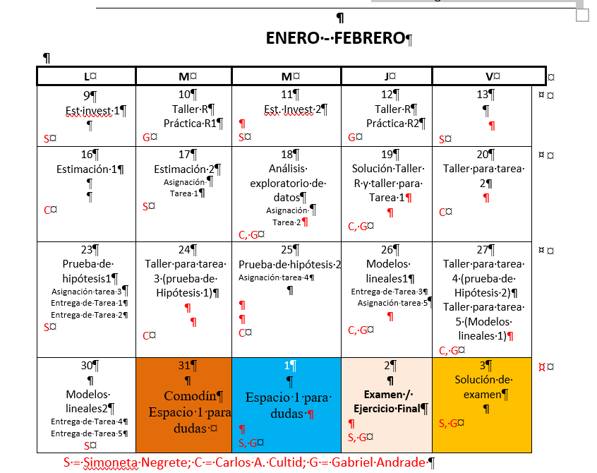
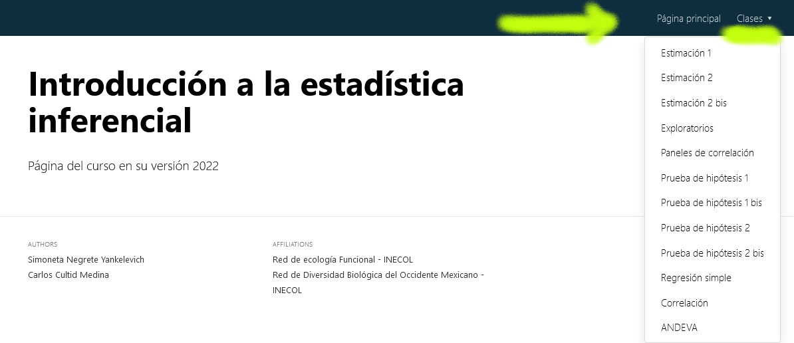

```{r setup, include=FALSE}
knitr::opts_chunk$set(echo = FALSE)

```

<aside>{width="112"}</aside>

## ¡Bienvenidos al curso!🙌

Este es la página del curso de **Introducción a la estadística inferencial**, versión 2023.


# Cronograma del curso 📆

[](https://classroom.google.com/u/0/c/MTg5NDkxODYwMzY0/m/NTQxMTU1OTg4NjM5/details)

# Material de la clase 📚

El material del curso está disponible en la página de classroom, en las siguientes ligas

1.  [Él papel de la estadística en la investigación](https://classroom.google.com/u/0/w/MTg5NDkxODYwMzY0/tc/MjcwNzUxODUyMTc2)

2.  [Introducción al Lenguaje R](https://classroom.google.com/u/0/w/MTg5NDkxODYwMzY0/tc/MjcwNjMxMTc1ODkx)

3.  [Estimación 1 y 2](https://classroom.google.com/u/0/w/MTg5NDkxODYwMzY0/tc/MjcwODkyMzU4Mjk5)

4.  [Análisis exploratorios](https://classroom.google.com/u/0/w/MTg5NDkxODYwMzY0/tc/MjcwODkyMzU4NDM1)

5.  [Prueba de hipótesis 1 y 2](https://classroom.google.com/u/0/w/MTg5NDkxODYwMzY0/tc/MjcwODkyNTcyNTc5)

6.  [Modelos lineales 1 y 2](https://classroom.google.com/u/0/w/MTg5NDkxODYwMzY0/tc/MjcwODkyNTcyODcx)

# Scripts de clase 📊

Los scripts pueden ser visualizados en html en la parte superior derecha de esta página.



Recuerden que las bases de datos se encuentran en el material de clase

## Adicional {.appendix}

**Monitor del curso 2023**

Gabriel P. Andrade Ponce 📧 [gabriel.andrade\@posgrado.ecologia.edu.mx](mailto:gabriel.andrade@posgrado.ecologia.edu.mx){.email}

**Edición de Scripts y página web**: Gabriel Andrade Ponce

Página hecha con la paquetería `distill` en RMarkdown
